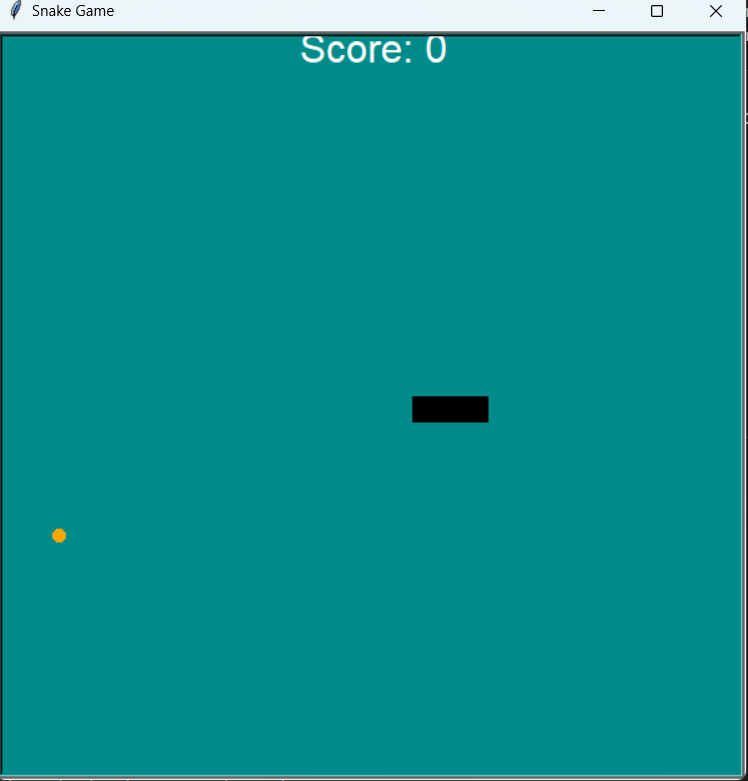

<h1 align=center>Snake Game</h1>
<h3 align=center><i>to practice python OOP and Turtle framework</i></h3>

## Explan About Files
**main.py:** this is the main file in the game, give first cardonation for screen-board size, snake, food and score
**snake:** included method for control snake movement and length
**food:** put food in random place in the board
**scoreboard:** responsibole for manage output text in screen board 

How to run the game:
```bash
Clone This Repo
python main.py
```

### Project Screenshot
